# Create a multi-sig wallet with Electrum
{: .no_toc }

## Table of contents
{: .no_toc .text-delta }

1. TOC
{:toc}

## Intro

You should now have the following information:

* A note with `Seed A - Coldcard`, `PIN Coldcard` and `PW`
* A note with `Seed B - Trezor`, `PIN-Trezor` and `PF-HW`
* A note with `Seed C - Ledger` and `PIN-Ledger`
* `Digital note` in Bitwarden containing:

```
PW: your_wallet_password
PF-HW: your_hardwarewallet_passphrase
PIN-Coldcard: hint_pin_coldcard
PIN-Trezor: hint_pin_trezor
PIN-Ledger: hint_pin_ledger
```

You need to have this at hand to finish the process:

* A computer connected to the internet (can be your normal computer).
* 1 USB flash drive
* Your three hardware wallet
* Your digital note in Bitwarden

## Download GnuPG for validating digital signatures

An important part of the guide (and a great skill to have) is to know how to validate digital signatures. This is skipped by many (I'm sometimes guilty of that myself). But don't skip it for this critical setup. It'll  only take a few minutes to download the software (one time effort) and then a few seconds to verify your downloads with the digital signatures. The validation will make sure that the downloaded file was signed by the developers of the project. This'll for example, catch a scenario where the official website was compromised and a malicious file was uploaded or where you went to the wrong website and downloaded a malicious file there.

We are using an implementation of the OpenPGP standard to verify signatures. The implementation varies for different OS:

*Windows:* Download and install the latest version of [Gpg4win](https://www.gpg4win.org). If you don’t want to donate, click bank transfer on the download page to access the download. You only need to install GnuPG and Kleopatra.

*macOS:* Download and install the latest version of [GPG Suite](https://gpgtools.org/)

*Linux:* [GnuPG](https://gnupg.org/) comes pre-installed with Linux distributions.

An easy way to verify a digital signature is to use a terminal (the command line).
In all examples, what´s written to the terminal is everything after the `$` sign (and examples that's specific for Windows uses the symbol `>`).

For example: `$ cd`
Means that you´d write `cd` to the terminal and then hitting return/enter (cd is a command that changes the active directory).
Usually you can paste text to a terminal with ctrl+v or with a right click on the mouse. Another useful shortcut is to use the arrows up and down to toggle between previously executed commands. If you´re stuck, you can usually kill a process with Ctrl+C or Ctrl+Z.

The symbol `~` is used as a shortcut to the home/user folder. It works on Mac, Linux and with PowerShell on Windows. That way you can for example write `~\Downloads` instead of the whole path `C:\Users\User1\Downloads`.

## Download and verify Electrum

Electrum is an open source wallet that has been around for many years. It offers great usability (support for multi-sig, hardware wallets etc) and you can connect it to your Bitcoin Core full node (with help of other software). 

Go to [https://electrum.org/#download](https://electrum.org/#download) and download the installer for your operating system (if you are using Windows, read the note on the bottom of the download page). Make sure to download the signature as well (the link is next to the installer). If you are taken to a new page when clicking on the signature use ctrl (or cmd) + s to save the text as a file.

We need the signing key of Electrum developer Thomas Voegtlin to verify the signatures. Scroll down to the bottom of the page and click on the “Public Key” link (you can skip this on Linux and use gpg --import ThomasV.asc):

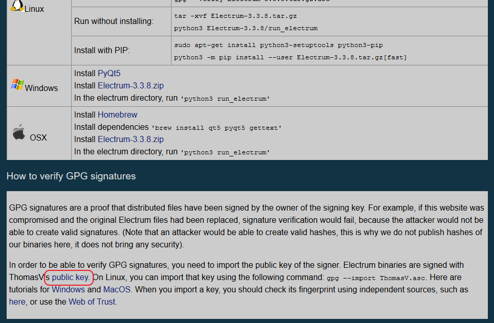

That should take you to a page with the public key, use `Ctrl+S` or `Cmd+S`and save the file `ThomasV.asc` on your computer (preferably in the same location as the downloaded installer).

Once downloaded we need to verify the signatures to make sure the developers signed this release.

Open a new terminal window.

On *Windows* you can go to the folder where your files are located, make sure nothing is selected, place your cursor in an empty space and then use `shift+right click`. That should bring up a menu where you can select `Open PowerShell window here`, you can then skip the `cd` command below.

Change the current directory to the one where the downloaded files are located:

`$ cd ~/Downloads`

Import the signing key from ThomasV into your local GPG installation:

`$ gpg --import ThomasV.asc`

Verifying the downloaded file by using the .asc-file to check that the file was signed with the signing key we imported:

`$ gpg --verify electrum-3.3.8-setup.exe.asc`

(make sure to change the file name if using a different version).

The verification can take a while.

The output should be something like:

```
gpg: assuming signed data in 'electrum-3.3.8-setup.exe'
gpg: Signature made 07/11/19 16:26:14 W. Europe Daylight Time
gpg:                using RSA key 6694D8DE7BE8EE5631BED9502BD5824B7F9470E6
gpg: Good signature from "ThomasV <thomasv1@gmx.de>" [unknown]
gpg: WARNING: This key is not certified with a trusted signature!
gpg:          There is no indication that the signature belongs to the owner.
Primary key fingerprint: 6694 D8DE 7BE8 EE56 31BE  D950 2BD5 824B 7F94 70E6
```

We need to check for three things here:

* The signing was made the same day as the release was uploaded (should be around the same time), you can see the dates [Here](https://download.electrum.org/).

* It´s a `Good signature`.

* A search online on `6694 D8DE 7BE8 EE56 31BE D950 2BD5 824B 7F94 70E6` seems to confirm that this key belongs to Thomas V. We are getting results from different sources that would be hard to fake (like old forum posts and guides). If you get a bad signature or another fingerprint, stop and investigate further before installing anything.


## Create the multi-sig wallet

We've now verified the signatures and can go ahead and run or install Electrum. When starting Electrum, you should be asked to create a new wallet (or load one if this isn't the first time using Electrum).

### [P] Using Electrum over Tor or with your own server

I know that leaving the guide isn't optimal at this point. But, if you are trying to keep your cold storage as private as possible you need to setup Electrum the right way before creating your main wallet. Otherwise information about your wallet will be sent to third party servers and you can never undo that. This is the main drawdown of using Electrum (if using the default setting, you'll leak privacy harming information), I wouldn't recommend using Electrum without at least Tor (but I really recommend using your own server).

So, the minimum step should be setting up Electrum to run over Tor. This will hide your real IP-address from any server. You can follow [the guide in the bonus section](/hodl-guide/hodl-guide_66_electrum-tor.md). If you are going to use your own server, you don't need to setup Electrum with Tor.

Even if you use Electrum over Tor, your addresses will still be clustered together (not visible on the blockchain, but for someone running a server you connect to). The only real solution to this is using Electrum with your own Bitcoin full node.

This can be a little bit tricky for a non-technical user, but it's constantly being easier and easier. If you have a full node up and running, there's guides for connecting it to Electrum  with "Electrum Personal Server" on [Windows](hodl-guide_63_eps-win.md) and [Mac](hodl-guide_64_eps-mac.md) in the bonus section. Linux user can watch a tutorial [Here](https://www.youtube.com/watch?v=1JMP4NZCC5g) (not my tutorial) or follow the official documentation. You can read more about the project on [https://github.com/chris-belcher/electrum-personal-server](https://github.com/chris-belcher/electrum-personal-server). As your multi sig wallet isn't created yet, you'll have to use another wallet for the server at first. You can use the "dummy" wallet in the Tor-guide if you don't have an existing wallet.

Once you've connected it to your own node, you can use all the great functions in Electrum. But without relying on someone else for verifying and broadcasting transactions. No one else will know what addresses you are interested in. You can use it for more “day-to-day” spending as well. You can connect a single hardware wallet to Electrum or use a hot-wallet (seed stored on the computer) and verify all transactions yourself.

### Creating your multi sig wallet

We are starting with Coldcard. This is the hardest part as we never will connect this wallet to the computer. So, insert a "micro SD-card" to your Coldcard and connect it to a power outlet. 

Navigate to `Add Passphrase` on the first screen. Move past the warning and select `Edit Phrase`. Enter `PF-HW` that you have in Bitwarden. Make sure to be careful with small/large cases. This isn't the most smooth process. Start by selecting type (1 for letters, 2 for number), navigate to correct spot and change the case if you have to. Move to next number with the right arrow on the Coldcard. Once done select `APPLY`.

Add the fingerprint you see on the screen to your note in Bitwarden. So, the note looks like this:

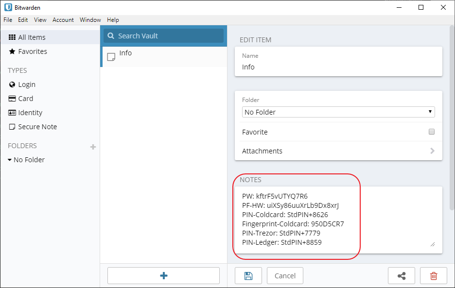

Then, on your Coldcard. Navigate to `Settings > Multisig Wallets > Export XPUB`
Click OK on the info-text. This will save a file, containing information we need on your SD-Card. You can disconnect the Coldcard when it's saved.

Remove the SD-Card from the Coldcard and insert it into your computer.

We can now move ahead and start Electrum. If you already have an Electrum Wallet open, go to `File>New/Restore` (or use Ctrl+N). Otherwise start Electrum, the install wizard should be launched automatically.

Pick a name for your multi-sig wallet and click Next:

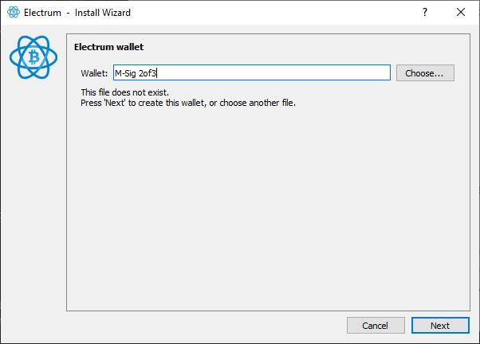

Select "Multi-signature wallet" and click Next:

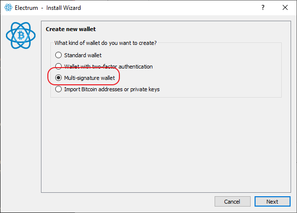

Change the first slider to 3 cosigners (with 2 signatures required) and click Next:

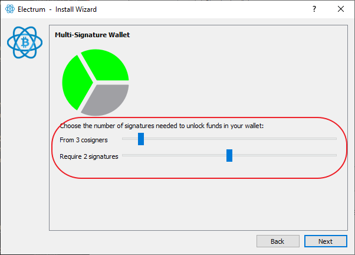


We are now going to construct our multi-sig. As we are starting with the `Coldcard` that wont be connected to the computer, select `Use a master key` and click Next. 

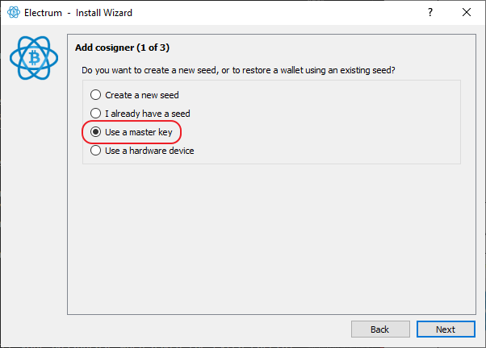

On the "Add cosigner" screen, select the folder:

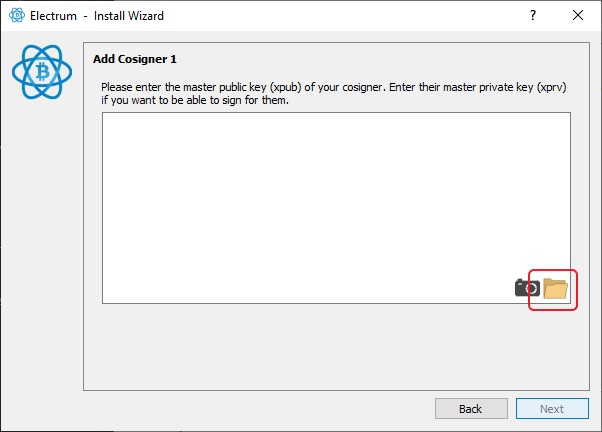

Navigate to you SD-Card and select the `.json` file and click Open:

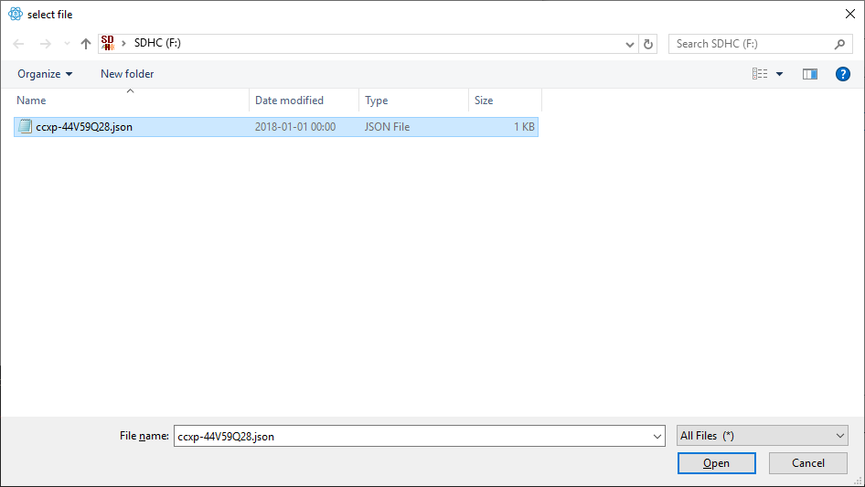

You'll see a lot of text:

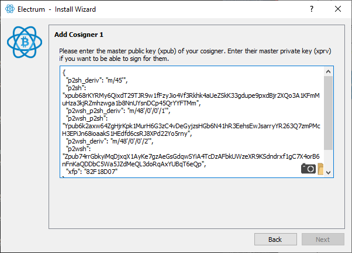

Remove everything except the last public key, `Zpub...`. Make sure you keep the `Zpub` and are removing everything else. This is the master public key we need to create a native Segwit multisig (will give us the lowest fees). Make sure to remove `"` as well. When you have a legit Zpub-key, you should be able to click Next, so do that:

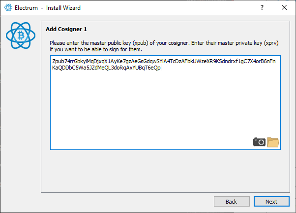

You'll see the Zpub again. Copy this and add it to a new row in your Bitwarden note. Name it `MPK1: Zpub...`. Then click Next:

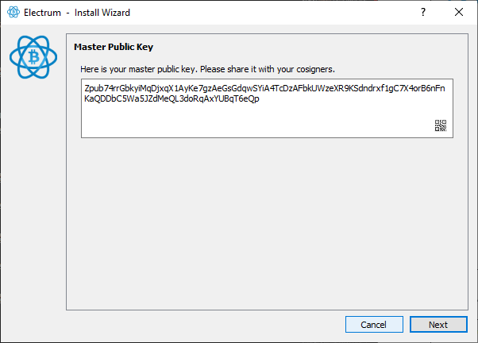


We are now moving on to our Trezor. Change to `Cosign with hardware device`, connect your Trezor to your computer and click Next:


Electrum should detect your Trezor automatically, click Next when the device is detected:

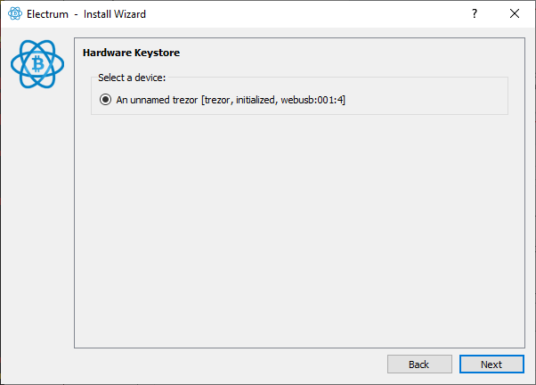

Enter the PIN that you used with your Trezor and then click OK:

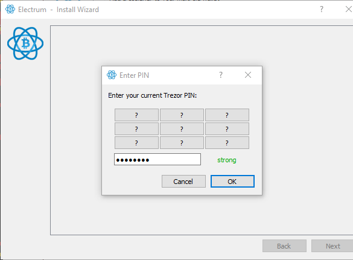

You should then be asked to enter a passphrase. Enter `PF-HW` and click OK:

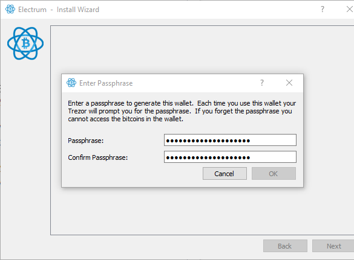

On the next page, make sure `native segwit multisig (p2wsh)` is selected and that the derivation path is `m/48'/0'/0'/2'`. Copy the derivation path to your note in Bitwarden and type `Derivation path: m/48'/0'/0'/2'`. Think of the derivation path as a file folder. It tells the wallet software where to look for your addresses. 

If this was completely random and you then lost your wallet file. The software wouldn't know where to look and you could loose your funds even if you have all the correct seeds. This isn't any risk now since we have written it down and are using Electrum which is a widely used wallet. So, the information about the derivation path is all over the web. When you've copied the derivation path, click Next:


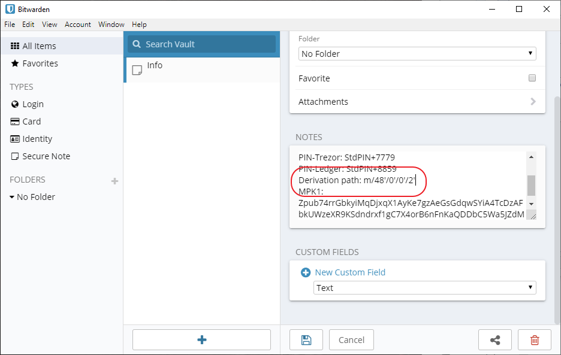

You are now done with the second key (we'll copy the Master Public Key for that, later). Move on to the third key. Connect the Ledger (disconnect the Trezor if you don't have room for both).

On Ledger Nano S, the passphrase is entered on the device (similar to how we did it on our Coldcard). So, you have to do this first.

Connect your Ledger and enter the PIN. Go to the "desktop" and navigate to "Settings". In settings, go to "Security". At the bottom, you should see "Passphrase", select that. You now have two choices.

The first option is "Set temporary". If you select that, you'll have to enter your passphrase into the wallet every time you use it (but can use your regular PIN).

The second option is "Attach to PIN". This way you'll have two PIN-codes. One normal and one "secret". If you select this, pick a new PIN and follow the directions on the screen and enter your passphrase when asked (be extra careful when entering the passphrase). You now have two PINs. One regular and one "secret". If you use this, you have to change the PIN in the corresponding information package as well (or first change the PIN on the Ledger and then use your first PIN as the "secret" PIN). Disconnect and reconnect the Ledger and use the "secret" PIN to unlock the device.

Make sure that the "Bitcoin app" is open on the Ledger device.

If you want more information check out [Ledgers guide](https://support.ledger.com/hc/en-us/articles/115005214529-Advanced-passphrase-security).

Once the passphrase is created, select `Cosign with hardware device` and click Next:

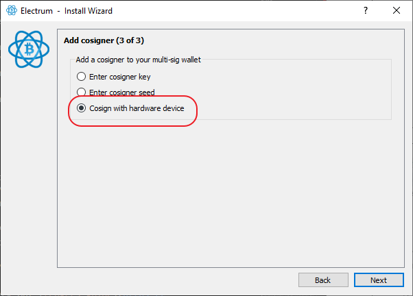

Your Ledger should be detected automatically (otherwise, rescan by clicking Next), click Next:


You should arrive at the same screen as before, we don't have to do anything here. Make sure it looks like before and click Next:


The wallet is now created. All we have to do is to protect it with a password that'll encrypt the wallet. The password if only for opening the wallet. So, it's mainly for privacy reasons as you'd still need 2 hardware wallets (or seeds) to spend anything. Use the first password we created, the `PW` in your Bitwarden note. Paste it and click Next:

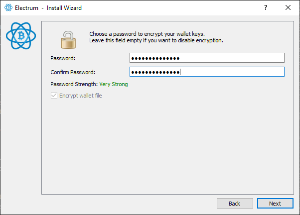

You should now see the following:

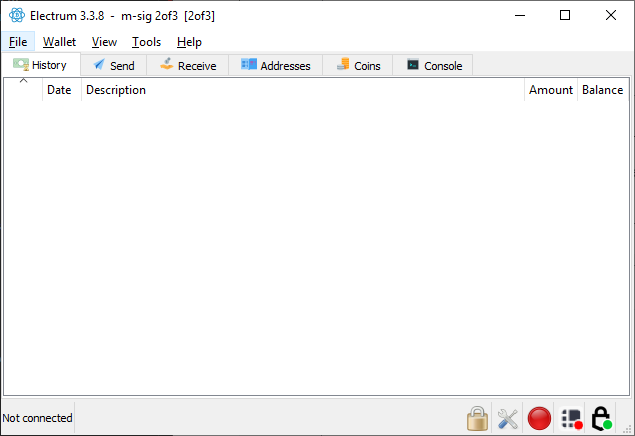

Congratulations, your wallet is created!

If you disconnected your Ledger or Trezor. You'll probably get an error message saying that Electrum cannot pair with your wallet. You can simply click `OK` and ignore that now. The last thing we'll do is to copy the two master public keys for Trezor and Ledger. In Electrum, go to `Wallet > Information`, select `cosigner 2 (keystore: hw[trezor])`, copy the `Zpub...` key and past it in your note in Bitwarden like `MPK2: Zpub...`. Repeat the process with `cosigner 3 (keystore: hw[ledger])` but paste it as `MPK3: Zpub...` . Your note in Bitwarden should look like this:

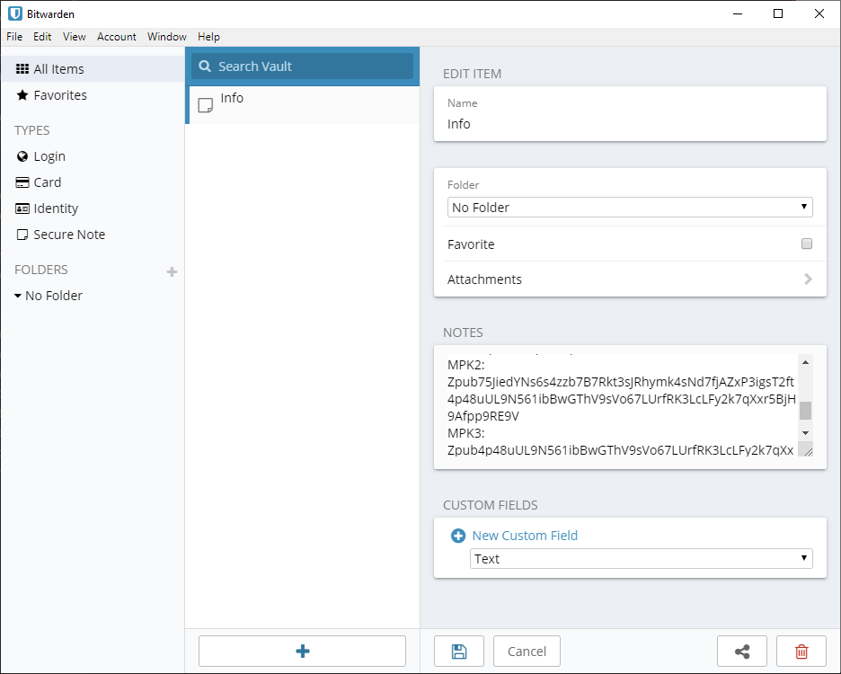

## Test deposit

We are going to deposit a small amount of bitcoin to one of our addresses to make sure everything works. You could use Testnet for this. But in the end of 2019, transactions are practically free if you're not in a rush. So, a few $ worth of bitcoin is plenty to try it out and I'm personally feeling that I learn more using real money for some reason. The amount should cover 3 transaction fees.

**[P]** Always think twice before depositing funds to your cold storage. I highly recommend you properly mix any coins deposited to cold storage (especially if they are from an exchange with KYC). This is only a test deposit to a one-time address. So, mixing isn't that important if you're using your own full node. But if you don't use your own full node and want to improve privacy, I would recommend mixing the funds. You can follow the guide for [using Wasabi Wallet](hodl-guide_62_wasabi-wallet.md) in the bonus section to learn more about mixing.

If you are using Electrum Personal Server. Add the three Master Public Keys to the configuration file now (close Electrum before starting the server and let it start up before opening your wallet). You don't need to rescan as it's a new wallet.

## Deposit Program

This can be used every time you want to deposit funds to your cold storage.

With your wallet open in Electrum, go to the "Receive" tab and copy the “Receiving address”. Before depositing anything, check the address on your Trezor. Do this by clicking on the "eye" in the address field (it can take a few seconds before the Trezor register your click). This isn't possible for multi-sig wallets with Ledger Nano S. Trezor One doesn't fully support it and will show a warning. But you can move past the warning and it'll show the address. This is important as malware could change the appearance of the receiving address. We'll reduce this risk by double checking the address on the Trezor. So, connect your Trezor and click on the eye that represents the Trezor. Make sure the address us the same as on the screen. You might have to enlarge the Electrum window to see the full address.

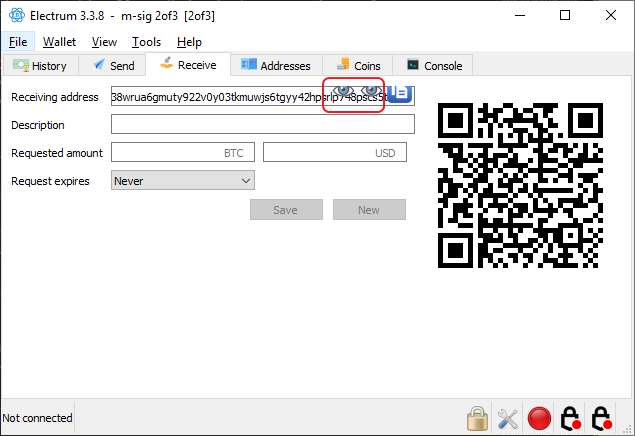

Use another wallet where you have some funds (like Wasabi Wallet or another Electrum wallet) and send some amount of bitcoin to the receiving address. You should see the unconfirmed balance almost immediately.

### Test your backup

If this is the first time using the wallet, we need to make sure that you really can access the wallet before depositing larger amounts.

*Optional*, wipe your 3 hardware wallets and restore them with the seed you wrote down for each wallet. The hardware wallets will perform checks during the setup. But this option will triple check everything and make sure that you can restore everything from the seeds you wrote down. Perform this step if you are unsure that you can recover from seeds.

If you don't wipe your device, at least clear the passphrase on your Coldcard and enter it again. There's some risk for errors there. The same is true for Ledger Nano S if you store the passphrase with a PIN (otherwise you'll enter it manually again anyway)

Now when entering the passphrase, use the other source of information. You probably used your digital note in Bitwarden for the password and passphrase the first time. Use the password on the `Seed A - Coldcard` Note and the passphrase on the `Seed B - Trezor` Note this time. This'll ensure that you wrote the correct information down. 

Otherwise disconnecting the Trezor and the Ledger from the computer. Close the electrum wallet. Open the wallet again and reconnect the Trezor and the Ledger. You can connect both at the same time, otherwise start with the Trezor and wait with Ledger until we've done the first withdrawal.

## Withdrawal program

This can be used whenever you like to withdraw funds from your cold storage.

If this is the firs time withdrawing from the wallet, we’re going to do two test withdrawals. The first one using Coldcard and Trezor. The second one using Coldcard and Ledger. Coldcard has the best support for confirming multi-sig addresses etc. So that should be our first choice. Trezor has the second best support for multi-sig. So that should be our second choice. If you are coming here at a later date, "Withdrawal method 1" should be your first choice.

### Withdrawal method 1
##TODO

Connect your Trezor and open your wallet in Electrum. On the Send tab, create an ordinary transaction with about half of your test amount to an address you control (like an address in Wasabi Wallet or in another Electrum Wallet) or send it to yourself in the same wallet with a new address. Once the transaction is constructed click `Send`:


Sign and confirm the transaction with one Hardware Wallet at the time, start with Hardware Wallet A. Control the information (like address and amount) on the hardware wallet.

Once confirmed, your transaction should be broadcasted!

### Withdrawal method 2

This method is very similar to the first. Just swap the Trezor for the Ledger (you could of course perform this step with the Trezor and the Ledger as well).

So, start with the Coldcard. Repeat the steps described for Coldcard in method 1. Then sign the transaction with your Ledger. 
Your transaction should be broadcasted to the network!

### Backup wallet file

When you feel comfortable that your setup works, we'll create a backup of your wallet file. Insert your USB-flash drive in your computer. With your wallet open in Electrum, go to `File > Save Copy`. Navigate to your USB-flash drive, give the file a name (it doesn't need any file name extension) and save it. 

In Electrum go to  `File > Open`, navigate to the file you saved and open it to make sure everything works.

## Backup the digital note

Before moving on, we'll create a backup of the note in Bitwarden. This'll be a "secure note" stored on your USB-flashdrive. It'll make restoring your funds easier.

For creating the encrypted secure note we'll use KeePassX. KeePassX is a small open source password manager that's been around for a long time. So, go to [https://www.keepassx.org/downloads](https://www.keepassx.org/downloads) and download the latest version for your operating system. You can verify the digital signatures for the download if you like. But this isn't critical software for us, so it's optional and can be skipped if you don't have the time.

When the download have finished, go ahead and extract the downloaded folder and start KeePassX. If `New Database` doesn't show up automatically, go to `Database > New database`. Then go to your note in Bitwarden and copy the `PW` that was the first password you generated (do not use the passphrase for the HW-wallets). Paste this as the password:

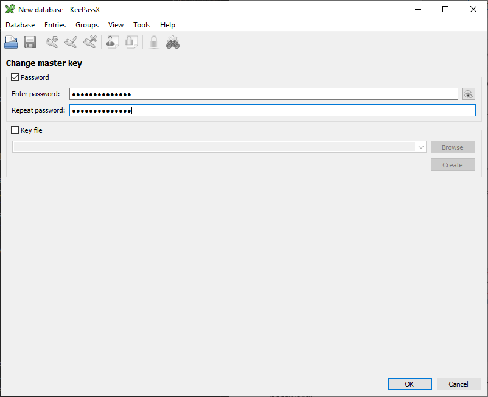

When the database is created go to `Entries > Add new entry`. Give it a name. Go to your note in Bitwarden, copy everything and then paste it in the `Notes` field in KeePassX 

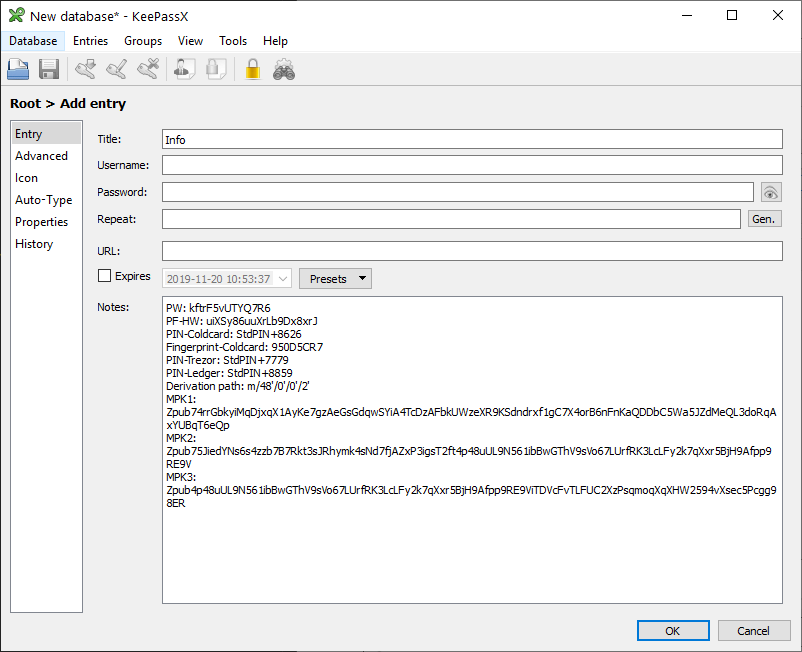

Click OK ta save the entry. 

Save a copy of the database to your USB-flash drive.

That’s it! Now we only need a plan to store everything.

---
Next up: [Storage >>](hodl-guide_50_storage.md)
