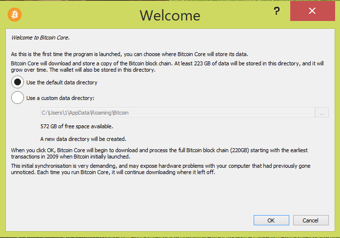
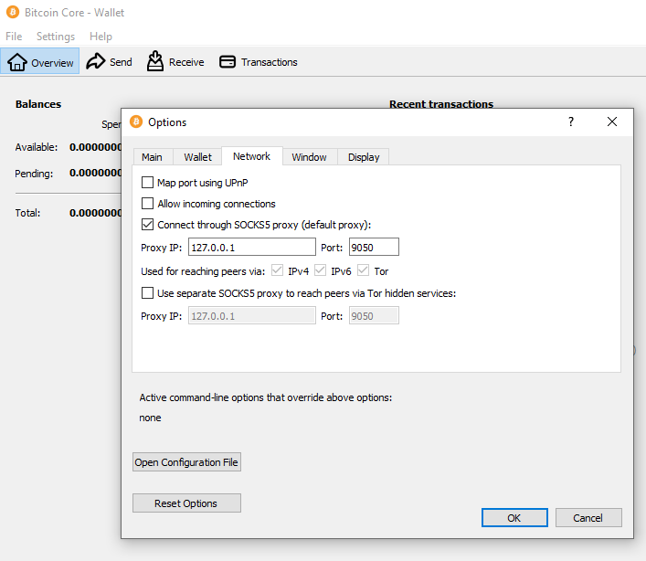
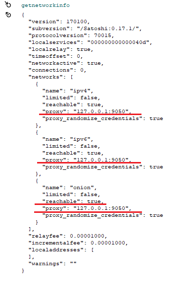

# Install and optimize Bitcoin Core

*Difficulty: easy*
{: .no_toc }

## Table of contents
{: .no_toc .text-delta }

1. TOC
{:toc}

Bitcoin Core is the main software implementation of the Bitcoin protocol. Once up and running it will give you a full node that validates all your transactions and enforces the consensus rules.

Before starting, you should have a basic understanding of what it means to run a full node.
If you don’t use a VPN or Tor with Bitcoin Core, your IP-address will be exposed to the network. From a privacy standpoint, that should be avoided. It will tell everyone that a Bitcoin full node is running on your IP-address. It’s also possible to connect transactions you do with your full node and your IP-address for someone who’s monitoring the network. This is still an improvement compared to trusting most third-party wallet providers. But it’s a pretty easy fix to improve it even more.

A VPN is an easy solution. This will improve your privacy. You trust the VPN provider to not share any logs. If Bitcoin isn’t illegal in your jurisdiction, that shouldn’t be too big of a deal.
If you´re using a VPN you´ll probably only be able to make outgoing connections (you can't open ports). That won´t affect the validation or broadcasting, but you´ll help the network a bit less since others can't download data from you.

An even better solution is to run the node over Tor. This’ll make your node very private. Downloading the blockchain over Tor can be very slow. So, it might be a good idea to first download the blockchain over clearnet (maybe with a VPN) and then configure the node to run over Tor. How to configure Bitcoin Core with Tor will be at the end of this guide.

### Download and verify Bitcoin Core

Start by downloading the latest version of Bitcoin Core for your OS on https://bitcoincore.org/en/download/

Before installing, you should always verify the digital signature of the downloaded file to make sure that the developers signed the release. This'll make sure that what you've downloaded is the version the developer uploaded and not a malicious version.

The easiest way to do this is with the GnuPGP and the command line. For more information on how to download and use GnuPGP, check the instructions [here](https://github.com/DriftwoodPalace/guides/blob/master/hodl-guide/hodl-guide_30_last-seed.md#download-gnupg-for-validating-digital-signatures).

There's instructions for how to validate Bitcoin Core on https://bitcoincore.org/en/download/. So, simply follow those.

The output for running `gpg --verify SHA256SUMS.asc` should be something like:

```
gpg: Signature made 08/09/19 09:08:43 W. Europe Daylight Time
gpg:                using RSA key 90C8019E36C2E964
gpg: Good signature from "Wladimir J. van der Laan (Bitcoin Core binary release signing key) <laanwj@gmail.com>" [unknown]
gpg: WARNING: This key is not certified with a trusted signature!
gpg:          There is no indication that the signature belongs to the owner.
Primary key fingerprint: 01EA 5486 DE18 A882 D4C2 6845 90C8 019E 36C2 E964
```

The important part is that the date`08/09/19`is around the same date as the uploaded file, that it´s a `Good signature` and that the fingerprint is `01EA 5486 DE18 A882 D4C2  6845 90C8 019E 36C2 E964`. You can do a search online and check various sources to control that this is the right signing key. 

If everything looks good, go ahead and install Bitcoin Core.

### Optimize the initial sync

Once the installation is done, run Bitcoin Core. You should see a screen that looks something like this:



Select where you'd like to store your data. We are going to download a lot of data and can do a few optimisations to get a faster initial download and a better user experience overall. Since the size of the blockchain is 250GB+ and constantly growing you might want to consider storing the blockchain on another disk then your main hard drive. The best solution is an internal hard drive but you could use an external as well (but you’ll have to plug it in every time you want to use Bitcoin Core). A common setup today is a smaller SSD-disk and a larger mechanical disk, you can in that case store the blockchain on the mechanical disk and have the parts that needs speed on the SSD.

Another solution is to use a smaller hard drive and use Bitcoin Core in pruned mode. This way you’ll discard old transactions and only have to store ~10 GB of data. You won’t be able to help new nodes with the initial sync, but you’ll still validate all transactions yourself.

Once you’ve decided where to store your blocks, click OK and let the initial sync start (that could take a couple of minutes). When the sync has started, the GUI should launch as well. You can then change a few settings. Go to Settings>Options.

On the main tab change "Size of database cache".


This will allocate more RAM to Bitcoin Core. To decide how much to allocate, 
check how much RAM your computer has (On Windows, Right Click on “This PC” and select “properties”). If you´re not going to run apps that use a lot of CPU during the initial sync, you could probably use 30% (or more) of your RAM without any issues. So if you have 8 GB of RAM you could try with 2400 MB (you can always change this later).

If you have more or less RAM, change 2400 to a number that suits you.

If you don’t have 250 GB of space and want to run your full node in pruned mode. Check "Prune block storage" here as well. Once done, click OK. If you have a configuration file, settings in that file will override settings here. In that case change `dbcache` and `prune`in the configuration file.

For changes to have effect we need to restart Bitcoin Core. So, shut down the running application. The sync will stop but we can resume it later.

Before starting Bitcoin Core again. If you have one SSD and store your blockchain on another mechanical hard drive, there´s one more optimization you can do. Quote from https://en.bitcoin.it/wiki/Splitting_the_data_directory

"Bitcoin Core's overall speed is significantly affected by the random-access speed of the contents of the chainstate directory; if your data directory is located on a magnetic disk, your chainstate access speed will very probably be the biggest performance bottleneck. You can therefore often massively improve performance by moving just the chainstate directory (which is only a few GB) to an SSD drive."

To move it:

* Make sure that Bitcoin Core is NOT running
* From the data directory (the folder you selected before), *cut* the chainstate directory (not just its contents, but the directory itself) and *paste* it somewhere on the target SSD drive.

Then on:

*Windows*: Open PowerShell as administrator (search for Powershell, right click and select “Run as Administrator”).
Change the directory to your data directory, for example:

`> cd D:\Bitcoin`

Make a link to where you pasted the folder, in the example below, chainstate is pasted in “documents”:

`> cmd /c mklink /D chainstate C:\Users\1\documents\chainstate`

*Mac/Linux:* Open a terminal in the data directory. On Linux, make sure that permissions allow for Bitcoin Core to read/write the directory and its files at the new location. Make a link to where you pasted the chainstate folder:

`$ ln -s /absolute/path/to/chainstate`. 

For example, if you moved your chainstate so that its new location is `/mnt/ssd/core/chainstate` (ie. within that directory are a bunch of ldb files), you'd run `$ ln -s /mnt/ssd/core/chainstate` from immediately within the data directory.

You should now see a link in your data directory folder (D:\Bitcoin in the example on Windows above)

You can now start Bitcoin Core and the sync should be much faster.

You can sync the blockchain in parts, you don't have to keep your computer running until the full blockchain is synced.

Once up and running, you can start and close Bitcoin Core whenever you like without any issues.

### Running Bitcoin Core over Tor

As we said earlier, running your Bitcoin Core node over Tor might be a good idea. This'll hide the fact that you are running a Bitcoin full node and you'll broadcast transactions in an anonymous way.

If you have Tor installed, this is literary only one checkbox. 
If you don’t have Tor installed, go to https://www.torproject.org/projects/torbrowser.html and follow the instructions for your operating system. You can launch the browser (I can recommend it, it's like using Firefox these days) or start Tor.exe (that should be located at `..\Tor Browser\Browser\TorBrowser\Tor`) to start Tor.

To activate Tor in Bitcoin Core, go to Settings>Options.
Change the tab to Network and select “Connect through SOCKS5 proxy (default proxy):”
Make sure Proxy IP is `127.0.0.1` and port `9050` (the Tor default port number):



Restart Bitcoin Core to activate changes.
More information at https://en.bitcoin.it/wiki/Tor

*Troubleshooting:* If you aren't getting any connections (you can see the number of connections by holding your mouse on the network symbol in the bottom right corner or by going to `Help>Debug Window` and change the tab to `Peers`), try changing the port to `9150`. Tor uses this port for Tor Browser on Windows.

*Optional*: Verify that you are connected over Tor. In Bitcoin Core, go to Help>Debug Window
Change the tab to Console and type `getnetworkinfo` and hit enter.

You should see the following output:



Make sure that “proxy” is 127.0.0.1:9050 (or 9150 if you've changed it) and that “onion” is reachable. If that’s the case (and you get connections) you are now using Tor.

Once this is done, Bitcoin Core won't connect to anyone else unless Tor is running.

---

<< Back: [Bonus guides](hodl-guide_60_bonus.md) 
